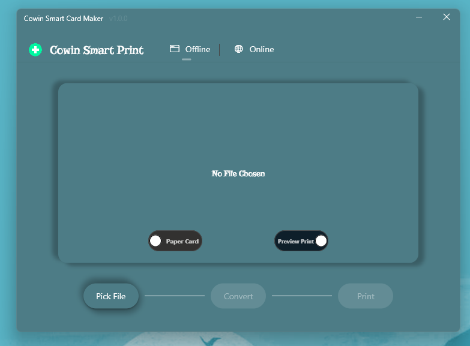
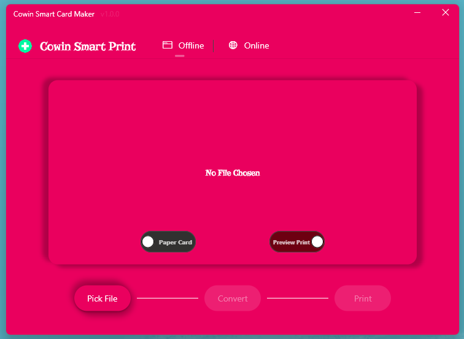
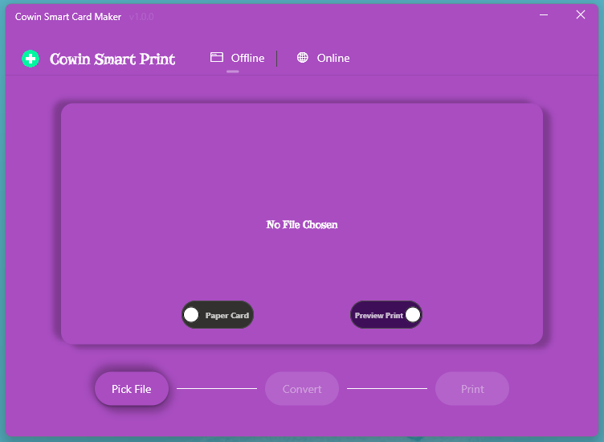
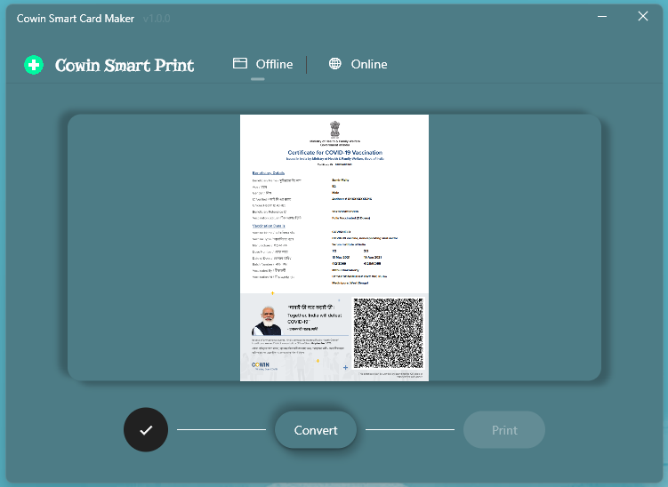
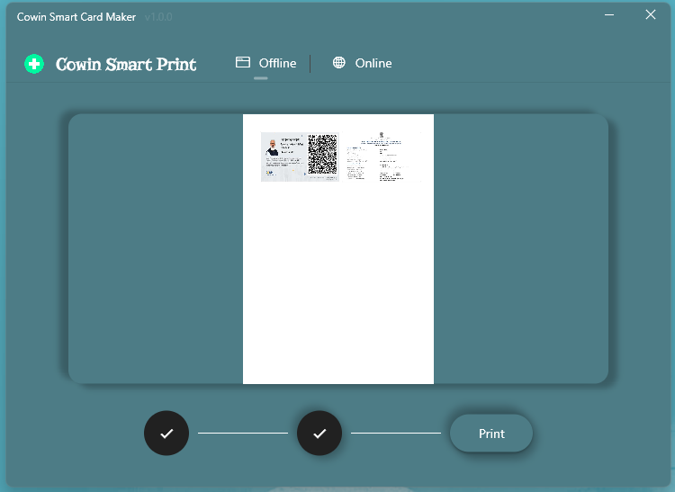

<image src = "./assets/logo.png" width = 150 >

---

# 
 CoWIN Smart Print 

---

> A GUI based CoWIN Certificate to Smart Card Converter.

</img>
</img>

## Features :

- Provides an Modern GUI
- Win 11 Style Themes and Dynamic Color Changes
- Supports all the CoWIN Certificates
- Can be converted to Smart Cards or Paper Cards
- Supports all the Smart Card Printers
- Legacy Printing or Modern Printing both suppoerted

## Installation :

- Download MSIX pakage and Install it

## Usage :

1. Select Card Type and Print Type using the sliders
2. Choose the Certificate you want to convert
3. Press convert and wait for the conversion to complete (at leasr wait for a minute)
4. Choose the printer you want to print the certificate

## Known Issues :

- No Start Over Feature added

## Upcoming Features :

- Direct download smart card using phone number and otp

  

  <ruby>
</ruby>

## More Screenshots :

 

  

</img>
</img>
</img>
</img>

# 
Contributors

 